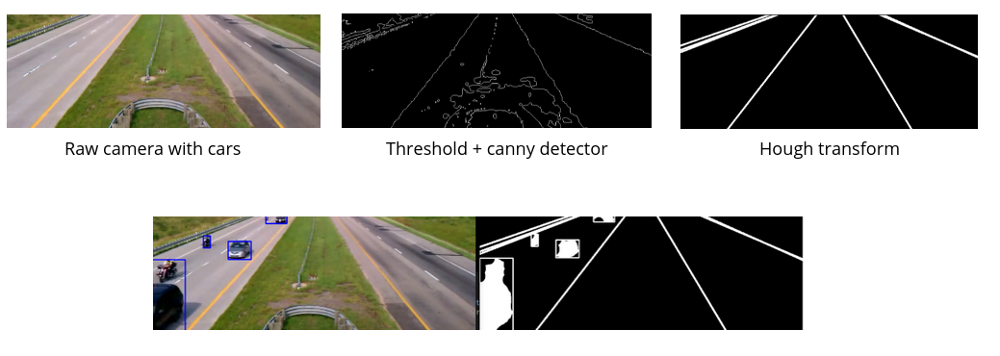
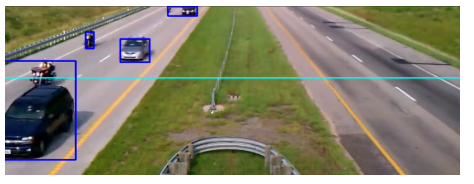

# Image Processing Practical Project : Counting Cars based on a video

Run the makefile to compile the code : ```make```, then execute the file : ```./main``

Given a record of a highway, the algorithm detects and counts the number of cars. 

Mathematical concepts : 

Hough transformation
-Segmentation
-Binarization
-Median filter
-Movement detection
-Edge detection





## How to count : moving box crossing the line

